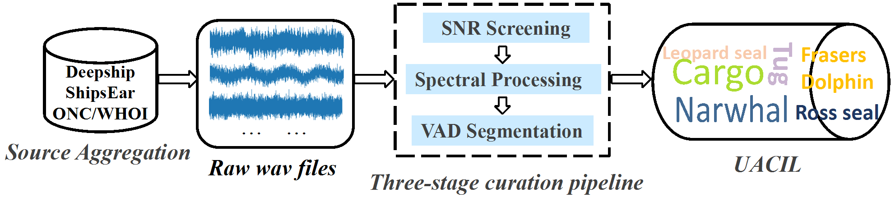
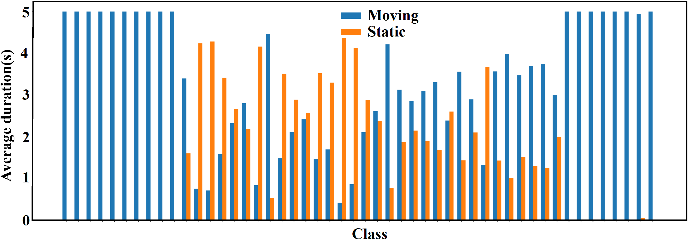
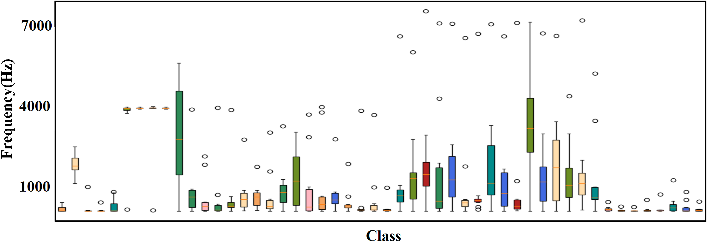

# Details of the UACIL dataset :o: 

## News :loudspeaker: 
March, 2025: We submitted our paper on the UACIL Dataset to the ACM MM2025 Dataset track. [Paper](https://pan.baidu.com/s/1X2W4LWSHaOJVFWH78Y77zA?pwd=99e7).


## How to obtain the dataset? :question: 

Because the file size exceeded the limit of github. We have provided the download link of Baidu Netdisk. Please click :link: [UACIL](https://pan.baidu.com/s/1NLujcA4ojMejegoE3zZXbA?pwd=8888).  


## CIL for UATR :exclamation: 
<div align="center">

</div>

## Dataset Detail :page_facing_up: 

Motivation for constructing the datasets: 

Underwater acoustic target recognition (UATR) struggles with adapting to new targets due to models' inability to balance knowledge retention and new information integration. Moreover, limited class diversity in public UATR datasets hinders the development of class incremental learning (CIL) methods, prompting us to introduce a novel UACIL dataset.

## Statistics of the dataset and its comparison with other datasets

| Dataset   | RecordingDuration | Classes | Bandwidth      | Sampling Frequency |
|-----------|-------------------|---------|----------------|--------------------|
| Deepship  | 47h4min           | 4       | 500Hz To 5kHz  | 32 KHz             |
| Shipsear  | 2.82h             | 5       | 500Hz To 4kHz  | 52.734kHz          |
| Watkins   | 4.92h             | 60      | 9Hz To 43kHz   | 320Hz To 192kHz    |
| Whale     | 10.75h            | 16      | 6Hz To 6.8kHz  | 22kHz To 48kHz     |
| Oceanship | 59.21h            | 15      | 50Hz To 3.7kHz | 16kHz              |
| UACIL     | 34.72h            | 50      | 5Hz To 7.6kHZ  | 16kHz              |


## Data Collection and Preprocessing
<div align="center">

</div>

:one: Crawl raw noisy underwater acoustic data, retaining natural noise.
:two:  Preprocess audio to a unified 16kHz sampling rate.
:three: Analyze duration distribution and effective speech length.
:four: Clip audio to 5 - second segments using VAD - based strategies.
<div align="center">

</div>
:five: Post - process samples with low speech ratios or no obvious speech.
<div align="center">

</div>

## Citing  

This repository contains the description of UACIL , which are proposed in the following paper:
```  
Qian Zhu, Qisheng Xu, Yi Su, Yulin Sun, Yutao Dou, Tao Li, and Kele Xu.
2025. UACIL: A Large-Scale Dataset for Class Incremental Learning in Underwater Acoustic Target Recognition. In Proceedings of Proceedings of the
33th ACM International Conference on Multimedia Datasets Track (MM ’25).
ACM, New York, NY, USA, 8 pages. 
``` 
