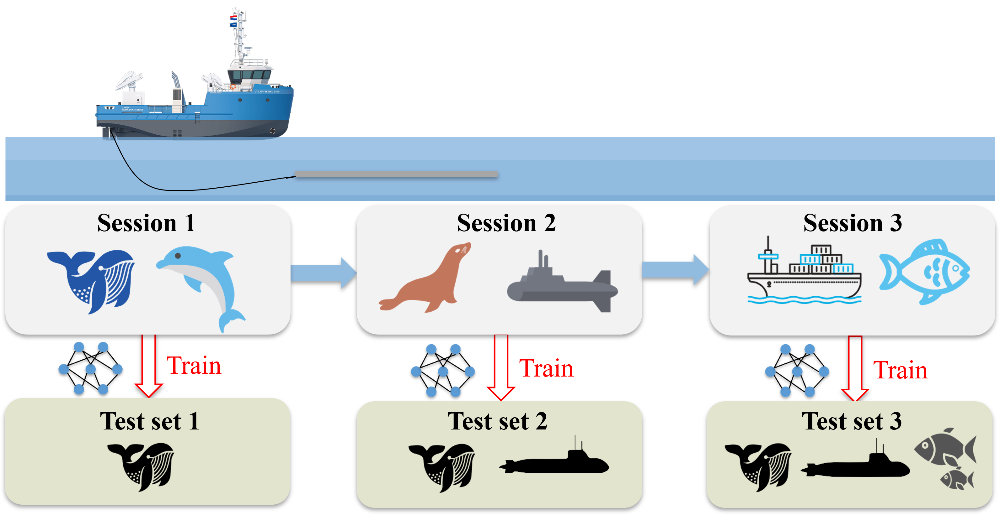

# Details of the datasets for for Class Incremental Learning in Underwater Acoustic Target Recognition👍👍👍

## News
March, 2025: We submitted our paper on the UACIL Dataset to the ACM MM2025 Dataset track.[Paper](https://pan.baidu.com/s/1X2W4LWSHaOJVFWH78Y77zA?pwd=99e7).


## How to obtain the data set?

Because the file size exceeded the limit of github. We have provided the download link of Baidu Netdisk. Please click [UACIL](https://pan.baidu.com/s/1X2W4LWSHaOJVFWH78Y77zA?pwd=99e7).


## Introduction 




## Citing  

This repository contains the description of UACIL , which are proposed in the following paper:
```  
Qian Zhu, Qisheng Xu, Yi Su, Yulin Sun, Yutao Dou, Tao Li, and Kele Xu.
2025. UACIL: A Large-Scale Dataset for Class Incremental Learning in Underwater Acoustic Target Recognition. In Proceedings of Proceedings of the
33th ACM International Conference on Multimedia Datasets Track (MM ’25).
ACM, New York, NY, USA, 8 pages. https://doi.org/XXXXXXX.XXXXXXX
``` 


## Dataset Detail

Motivation for constructing the datasets: 

Underwater acoustic target recognition (UATR) has made significant strides, largely driven by advances in deep learning. However, most existing methods are trained on a fixed set of target classes and struggle to adapt to continuously emerging targets in real-world underwater environments, resulting in substantial performance degradation. This limitation arises from the models' inability to maintain previously acquired knowledge (stability) while integrating new information (plasticity), highlighting the need for incremental learning frameworks capable of balancing both. Moreover, publicly available UATR datasets suffer from limited class diversity—for instance, DeepShip and ShipsEar contain only five classes—rendering them inadequate for developing and evaluating class incremental learning (CIL) methods in realistic underwater scenarios.
To address these challenges, we introduce a novel underwater acoustic dataset specifically designed for class incremental in UATR. Constructed from real-world recordings, the dataset comprises 50 diverse acoustic classes, including both anthropogenic and marine biological sources, and reflects the complex, noisy, and dynamic conditions encountered in operational environments. We further establish a comprehensive benchmark on this dataset, evaluating a range of backbone architectures and state-of-the-art CIL algorithms under the UATR setting. Our contribution offers a standardized tool for advancing research in class incremental learning within underwater acoustics, facilitating the development of robust models capable of adapting to continuously evolving acoustic targets.


## Statistics of the dataset and its comparison with other datasets

| Dataset   | RecordingDuration | Classes | Bandwidth      | Sampling Frequency |
|-----------|-------------------|---------|----------------|--------------------|
| Deepship  | 47h4min           | 4       | 500Hz To 5kHz  | 32 KHz             |
| Shipsear  | 2.82h             | 5       | 500Hz To 4kHz  | 52.734kHz          |
| Watkins   | 4.92h             | 60      | 9Hz To 43kHz   | 320Hz To 192kHz    |
| Whale     | 10.75h            | 16      | 6Hz To 6.8kHz  | 22kHz To 48kHz     |
| Oceanship | 59.21h            | 15      | 50Hz To 3.7kHz | 16kHz              |
| UACIL     | 34.72h            | 50      | 5Hz To 7.6kHZ  | 16kHz              |


## Data Collection and Preprocessing

### Dataset Clipping

To adapt to the fixed input dimensions of mainstream audio classification models (such as CNN and Transformer) for Mel spectrogram's time-frequency matrix, audio duration must be unified. For example, a 10-second audio (16kHz sampling) and a 5-second audio converted to Mel spectrograms have different time-axis dimensions (400 frames and 200 frames respectively), making batch input impossible. The reasons for unifying the duration to 5 seconds include:

- Meeting the hard input requirements of models to avoid padding noise or truncation errors and improve training efficiency;

- 5 seconds typically captures complete acoustic features for short events (e.g., cough sounds) or long-semantic classification (e.g., speech emotion recognition);

- The original 10-second data verified by VAD shows that the average duration of effective speech is ≥5 seconds, ensuring key information retention.

Duration selection balances the original data length (10s→5s), effective speech coverage (ensuring main information via VAD), and computational efficiency. General steps include: statistical analysis of dataset duration distribution and effective speech duration (e.g., 5 seconds is a reasonable compromise if 80% of samples have effective speech concentrated in 3-7s), verification of feature distinguishability (e.g., 5-second Mel spectrogram with 500 frames captures mid-low frequency dynamic features), and experimental evaluation of candidate durations (3s/5s, etc.) for fitting effect and computational load.

### VAD-Based Clipping Strategy

Implementation steps:

- Preprocess audio to a unified sampling rate of 16kHz;

- Statistically analyze total speech duration and continuous segment distribution to determine if there are continuous speech segments ≥5 seconds (5 seconds confirmed by prior statistics);

- Select strategies based on speech distribution:

- Long continuous segments: Center or fully retain key segments to maintain context;

- Scattered speech: Use a 1-second sliding window to select the 5 seconds with the highest speech ratio;

- Semantic integrity requirement: Clip based on speech start-stop boundaries to avoid truncation.Post-processing involves correcting samples with low speech ratios (e.g., adjusting VAD thresholds or manual annotation). For samples with no obvious speech (e.g., silence), random or fixed-position clipping (e.g., middle 5 seconds) can be applied, with control over the proportion of such samples to avoid affecting model training.

VAD analysis is critical to prevent key speech truncation or excessive silence, ensuring clipped segments retain target information. Arbitrary clipping may cause information loss, while padding zeros for audio shorter than 5 seconds misleads model learning.

### Considerations on Dataset Authenticity

Real underwater acoustic signals (e.g., sonar echoes, ship radiated noise) always coexist with background noise, with signal-to-noise ratios (SNR) as low as -10dB~+5dB. Models need to learn to extract weak features from strong noise. Public datasets often provide preprocessed clean signals for research convenience, but real-world noise has complex distributions (non-Gaussian, non-stationary, e.g., impulsive ship noise) and may overlap with signal time-frequency distributions (e.g., 500Hz-2kHz band for both target signals and noise). Therefore, when crawling raw noisy data, noise can be retained (e.g., excluding the 'background' category in Deepship datasets) to avoid training models with only clean data, which may fail due to insufficient noise robustness in real scenarios.
